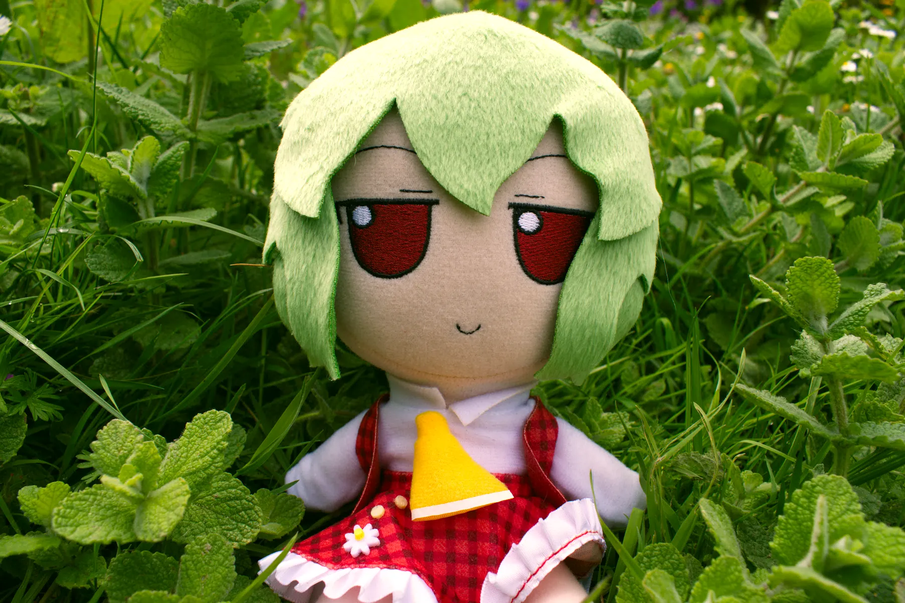
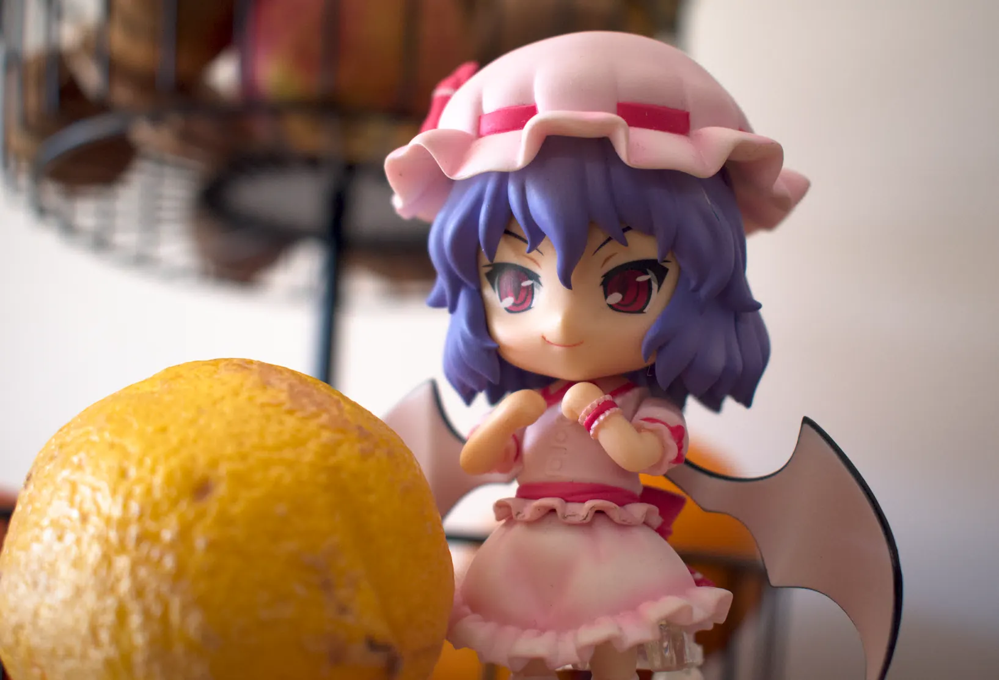
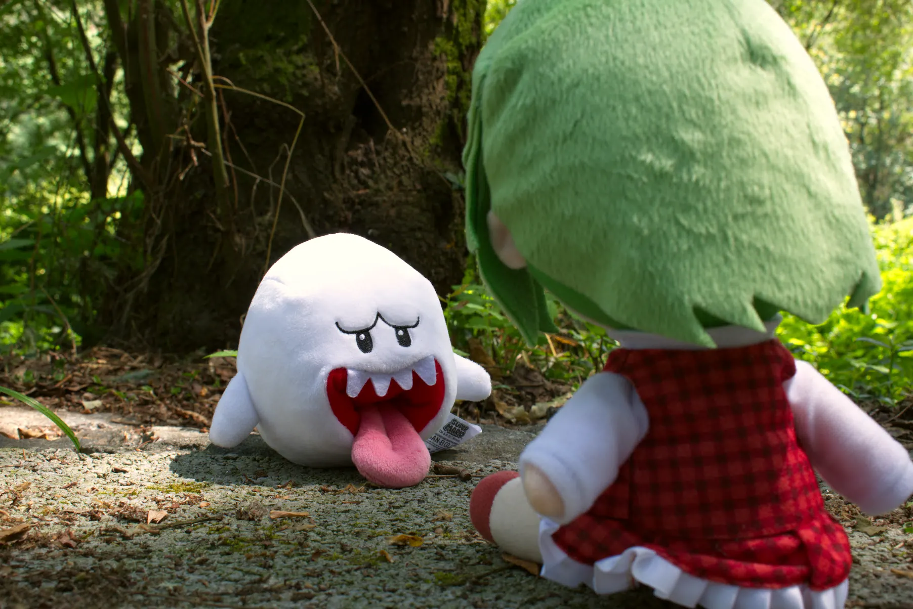
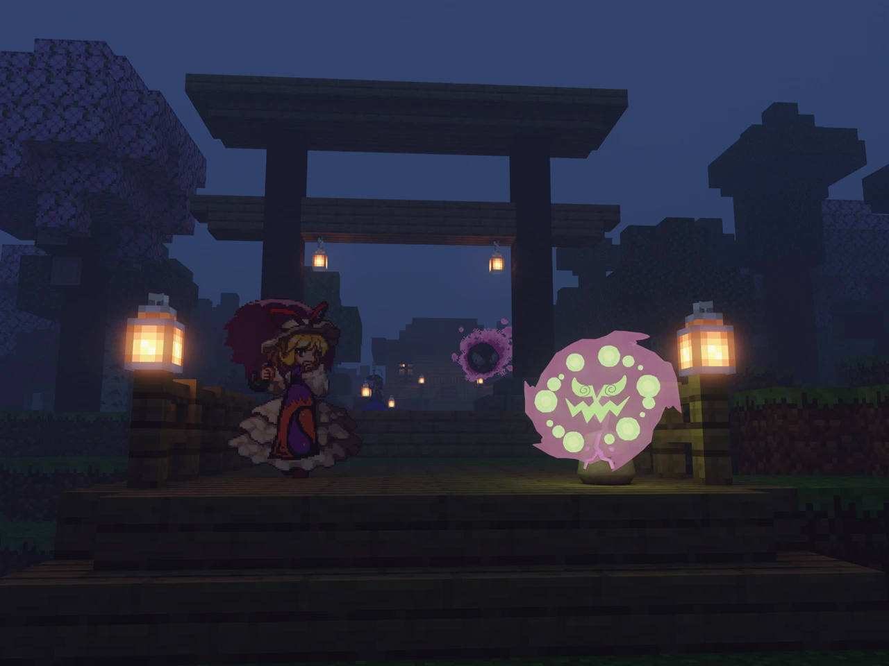
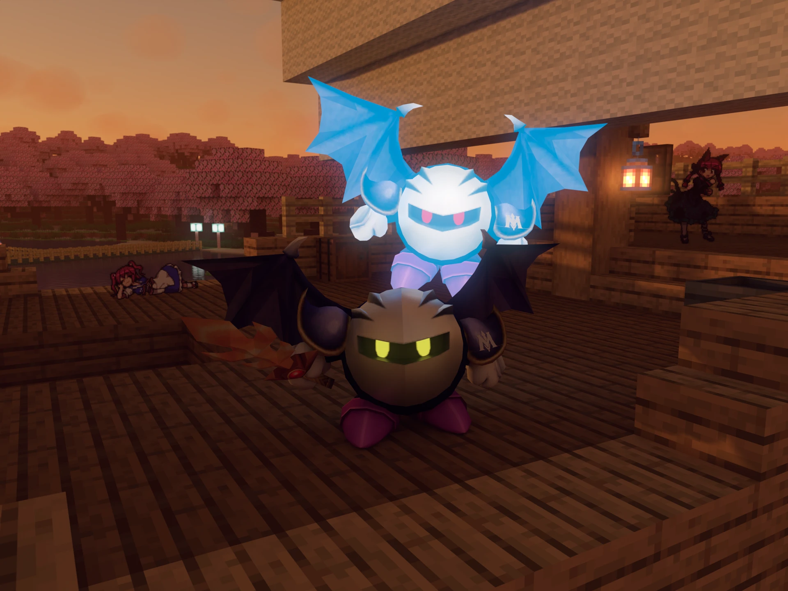

# Image Manipulation, Photography and 3D image

Digital image creation was my first computer hobby ever besides playing videogames and tinkering with the system itself. When I was a kid I used to make simple games/places on Roblox with Roblox Studio and I needed to edit an image for one of my games. That was the moment I first worked with any kind of image. Back then I used Adobe Fireworks CS3.

Nowadays, I dedicate deeply to various forms of image creation. I have a necessity to project a vision of characters I like in a certain world or context, and as result I usually create various images with my favourite characters.

## Image manipulation

When I say "image manipulation" I refer to all my images that came from a 2D environment. I make these images with my beloved GIMP, but in the past I used Krita, Photoshop CC 2021 and 2019, Fireworks CS3 and others.

The process starts in gathering the raw materials: the portraits or sprites of a character and the background image. I usually use official portrait and sprite artworks if the character in question comes from Touhou, Pokémon or is a UTAU/Vocaloid/etc. For Touhou, I also create a character setup with Walfas, and old Flash Player project.

Very often the background image is mine, usually a photograph I took or a high resolution screenshot taken in Space Engine, Vintage Story, Minecraft or similar games that give you some level of control.

  
  
  

## Photography

I am also a photographer. I started taking photography more seriously by 2020 and my interest increased a lot when I got myself a DSLR camera. I like toy photography the most, using plushies, figures and nendoroids exactly because it's a direct real-life equivalent of what I do with GIMP and Blender. I also like photographing plants, animals and landscapes, though I prefer if I can at least compose a plush into the scene.

  
  
  

## 3D image

3D images are image renders created from a 3D scene. A 3D world is less convenient to build compared to making an image on GIMP but it gives much better control over perspective, lighting, depth and other characteristics. I use Blender for my 3D images, and I often use 2D sprites placed on my 3D world and sometimes proper 3D models of characters. To create a world conveniently, I build it in Minecraft then export it as a 3D model. Or I sculpt and paint the terrain then place Minecraft constructions and trees on it.

While I use Blender now, I have used Unity and Source Filmmaker before for this purpose and I occasionally use Garry's Mod.

  
  
  

